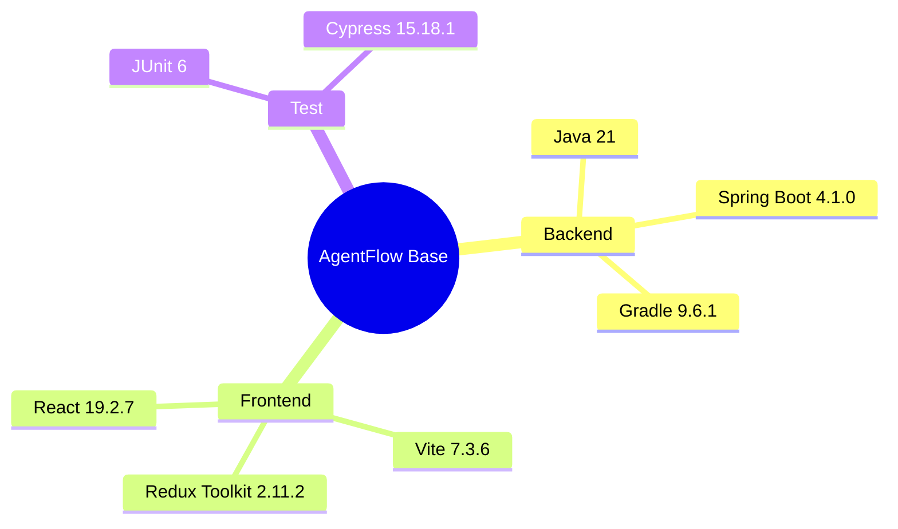

# Implementation Plan：系統架構設計

## 目錄

- [技術樹（心智圖）](#技術樹心智圖) — 目前穩定技術基線
- [Technical Context](#technical-context) — 架構與限制
- [Constitution Check](#constitution-check) — 五項原則均符合
- [Project Structure](#project-structure) — 前後端分離位置
- [Implementation Strategy](#implementation-strategy) — 建置順序

## 技術樹（心智圖）



- Backend：Java 21、Spring Boot 4.1.0、Gradle 9.6.1
- Frontend：React 19.2.7、Redux Toolkit 2.11.2、Vite 7.3.6
- Test：Spring Boot Test／JUnit、Cypress 15.18.1

## Technical Context

後端以 MVC 分層提供 REST；Gradle 設定只存在 `backend/`，Node Gradle plugin 在 build 階段呼叫 `frontend/` 的 npm build。前端使用 TypeScript、Hook、Redux slice 與 React Router。

## Constitution Check

- [x] Sheet MUST 需求具有 FR 與 task 對應。
- [x] BO → DAO → Service → Controller 分層明確。
- [x] React/Redux 與 `uiux/` 樣式相符。
- [x] 建置命令包含後端測試與前端編譯。
- [x] 無未說明的憲章例外。

## Project Structure

```text
backend/src/main/java/com/agentflow/base/{model,dao,service,controller,security,config,exception}
frontend/src/{app,components,features,pages}
frontend/cypress/e2e
```

## Implementation Strategy

先建立 Gradle/Spring Boot，再建立 React/Redux，最後以 Gradle `build` 串起兩端並由 Cypress 驗收頁面流程。
