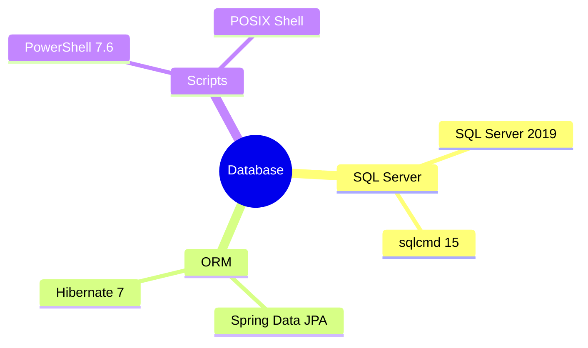

# Implementation Plan：資料庫基礎

## 目錄

- [技術樹（心智圖）](#技術樹心智圖) — MSSQL 與 JPA
- [Technical Context](#technical-context) — 資料建置方式
- [Constitution Check](#constitution-check) — 命名與審計閘門
- [Data Design](#data-design) — 四張單數表
- [Implementation Strategy](#implementation-strategy) — 腳本與 JPA 順序

## 技術樹（心智圖）

- SQL Server：SQL Server 2019、sqlcmd 15
- ORM：Spring Data JPA、Spring Boot 管理的 Hibernate
- Scripts：PowerShell 7.6、POSIX Shell

## Technical Context

本機 MSSQL 可由 Windows 整合驗證連線。初始化腳本建立 `base_20260716_01` 與同名專案 Login；應用程式以環境變數覆寫連線設定，JPA `ddl-auto=update` 建表。

## Constitution Check

- [x] UUID 主鍵與審計欄位集中於 BaseEntity。
- [x] 表與欄位採單數 snake_case。
- [x] 關聯表有自身 UUID 與明確 FK。
- [x] 初始化腳本驗證名稱並保持冪等。

## Data Design

`app_user` 1:N `user_role` N:1 `role`；`test` 為獨立 CRUD 驗證表。詳見 `data-model.md`。

## Implementation Strategy

先完成跨平台 DB bootstrap，再建立 BaseEntity 與 JPA BO/DAO，最後以 H2 自動測試及 MSSQL 啟動測試雙重驗證。

