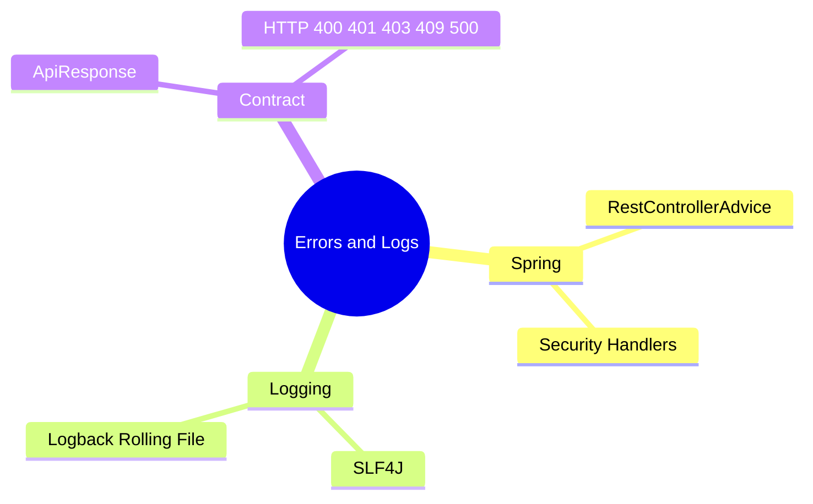

# Implementation Plan：例外處理與 Log

## 目錄

- [技術樹（心智圖）](#技術樹心智圖) — 例外與日誌元件
- [Technical Context](#technical-context) — 錯誤傳遞策略
- [Constitution Check](#constitution-check) — 可觀測與安全
- [Error Contract](#error-contract) — 一致 JSON envelope
- [Implementation Strategy](#implementation-strategy) — 由底至頂驗證

## 技術樹（心智圖）

- Spring：`@RestControllerAdvice`、Security handlers
- Logging：SLF4J、Logback rolling file
- Contract：ApiResponse、標準 HTTP status

## Technical Context

Controller、Service、JWT filter 與資料操作記錄適當層級 Log；例外 Advice 統一 Response。Security filter chain 的 401/403 由專用 handler 以同一 envelope 回應。

## Constitution Check

- [x] 未知例外記錄 stack trace 但不回傳內部資訊。
- [x] 權限失敗訊息符合 Sheet 原文。
- [x] 前端有獨立無權限頁。
- [x] 所有錯誤均非靜默失敗。

## Error Contract

`{ success:false, message:string, data:null, timestamp:string }`；401 表示未認證、403 表示已認證但無權限。

## Implementation Strategy

先建立 envelope 與 BusinessException，再建立 Advice、Security handlers、Logback，最後用一般使用者端到端測 403。

