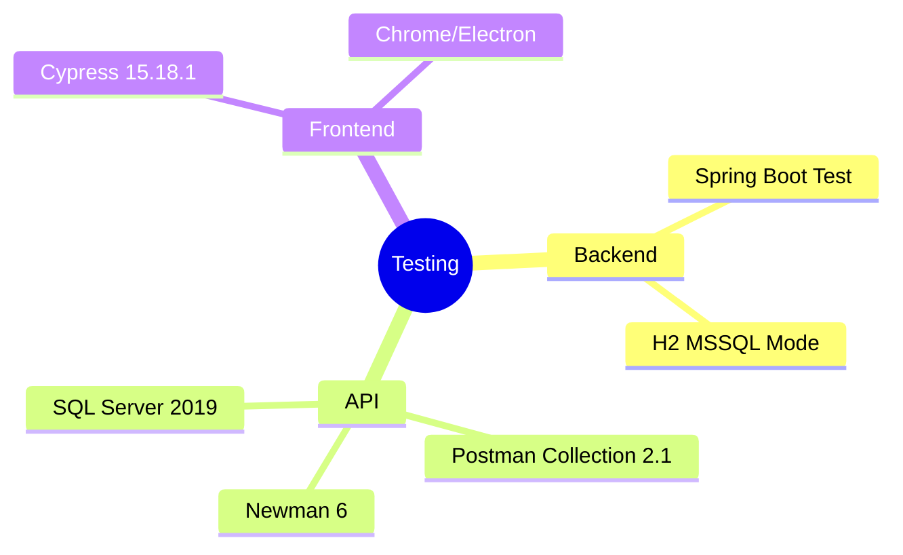

# Implementation Plan：整合測試

## 目錄

- [技術樹（心智圖）](#技術樹心智圖) — 三層測試工具
- [Technical Context](#technical-context) — 測試環境
- [Constitution Check](#constitution-check) — 報告閘門
- [Test Matrix](#test-matrix) — task/FR 覆蓋
- [Implementation Strategy](#implementation-strategy) — 由快速到完整

## 技術樹（心智圖）

- Backend：Spring Boot Test、H2 MSSQL mode
- API：Postman collection 2.1、Newman、SQL Server 2019
- Frontend：Cypress 15.18.1

## Technical Context

自動測試使用隔離 H2；Postman 與 Cypress 實際啟動後端連本機 MSSQL，前端由 Vite 提供。測試資料以時間戳避免衝突並在 CRUD 流程刪除。

## Constitution Check

- [x] 後端、API、前端三層均有可重現命令。
- [x] 報告含分子、分母、完成率與失敗數。
- [x] 測試覆蓋所有 P1 User Stories。
- [x] tasks 完成後才回寫 Sheet。

## Test Matrix

登入／權限、使用者新增預設角色、test CRUD、React 路由與 UI 操作皆同時對應 FR、Postman 或 Cypress assertion。

## Implementation Strategy

先跑 Gradle tests，再啟動 MSSQL backend 跑 Newman，最後啟動 Vite 跑 Cypress；任一紅燈即修復並重跑全套。

