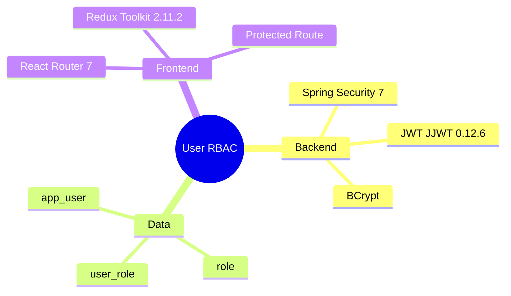

# Implementation Plan：使用者角色權限

## 目錄

- [技術樹（心智圖）](#技術樹心智圖) — JWT 與 RBAC
- [Technical Context](#technical-context) — 認證授權架構
- [Constitution Check](#constitution-check) — 資安與 UI 閘門
- [Data and API Design](#data-and-api-design) — 完整分層
- [Implementation Strategy](#implementation-strategy) — 安全優先順序

## 技術樹（心智圖）

- Backend：Spring Security、JJWT 0.12.6、BCrypt
- Data：app_user、role、user_role
- Frontend：React Router 7、Redux Toolkit、Protected Route

## Technical Context

無狀態 JWT filter 在 Security filter chain 驗證 token；`AccountService` 提供 UserDetails，Controller 以 method security 限制 SYSTEM_ADMIN。前端 Redux 保存 session，Guard 同時檢查登入與角色。

## Constitution Check

- [x] 密碼只存 BCrypt hash。
- [x] JWT 有簽章與到期時間。
- [x] RBAC 同時存在 API 與前端路由。
- [x] UI 操作、色彩、表格與 tab 依 `uiux/1.1.使用者分權`。
- [x] CRUD 完整經 BO、DAO、Service、Controller、React page。

## Data and API Design

詳見 `data-model.md` 與 `contracts/openapi.yaml`。使用者建立時在同一 transaction 建立 EMPLOYEE 關聯；角色授予以 unique constraint 保持冪等。

## Implementation Strategy

先建立資料與 seed，再建立 AuthenticationManager/JWT/filter chain，接著完成管理 Service/API，最後串接 React login、users、roles 與無權限頁。

