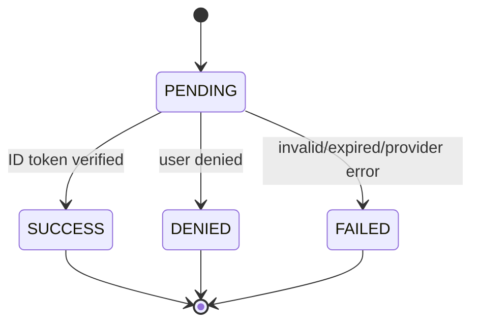

# Data Model：LINE OAuth 註冊登入

## `line_oauth_account`

| 欄位 | 型別/限制 | 說明 |
| --- | --- | --- |
| id | UUID PK | BaseEntity |
| user_id | UUID FK, unique, not null | 對應 `app_user` |
| line_user_id | varchar(80), unique, not null | 已驗證 ID token 的 `sub` |
| display_name | nvarchar(120), not null | LINE 顯示名稱 |
| picture_url | varchar(500), null | LINE 大頭貼 HTTPS URL |
| created_at / updated_at | datetimeoffset, not null | 審計時間 |

## `line_oauth_attempt`

| 欄位 | 型別/限制 | 說明 |
| --- | --- | --- |
| id | UUID PK | BaseEntity |
| state_hash | char(64), unique, not null | 原始 state 的 SHA-256 hex |
| code_verifier | varchar(128), null | PKCE 暫存；終態清除 |
| nonce | varchar(128), null | ID token 驗證暫存；終態清除 |
| status | varchar(24), not null | PENDING / SUCCESS / DENIED / FAILED |
| result_code | varchar(64), null | 非敏感結果碼 |
| expires_at | datetimeoffset, not null | 流程逾時 |
| completed_at | datetimeoffset, null | 完成時間 |
| user_id | UUID FK, null | 成功時關聯 `app_user` |
| created_at / updated_at | datetimeoffset, not null | 審計時間 |

## Existing Entities

- `app_user`：LINE 首次註冊使用 `registration_method=LINE OAuth`，密碼欄保存無法由使用者得知的 BCrypt 隨機值。
- `user_role`：首次註冊建立 EMPLOYEE；唯一鍵避免重複角色。

## State Transitions

終態不可再進行 callback，`code_verifier` 與 `nonce` 必須清除。
