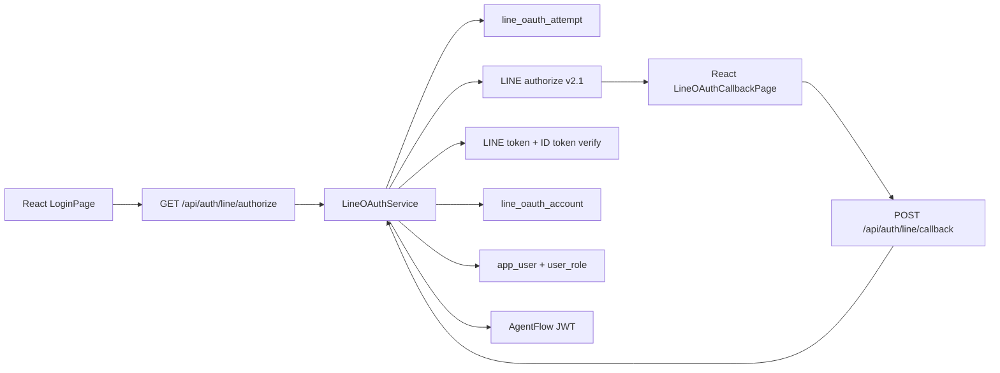

# Implementation Plan：LINE OAuth 註冊登入

## Technical Context

- Backend：Java 21、Spring Boot 4.1、Spring Security、JPA、Java HttpClient、JJWT。
- Database：SQL Server 2022；測試採 H2 MSSQL mode。
- Frontend：React 19、Redux Toolkit、React Router、Vite。
- Validation：JUnit/MockMvc、Postman/Newman、Cypress。
- External protocol：LINE Login OAuth 2.0 / OpenID Connect v2.1。

## Constitution Check

- [x] Sheet 第 25–28 列各有 FR、task 與 checklist。
- [x] 規劃 DB 表 → JPA DAO → Service → BO → REST Controller → React page。
- [x] UUID 主鍵、審計時間、單數 snake_case 表名。
- [x] 錯誤有 API 訊息、資料庫稽核與非敏感 Log。
- [x] UI 延續 `uiux/0.共用樣式/login.html` 的雙欄登入流程與響應式版型。
- [x] 完工門檻包含 Gradle build、Postman/Newman、Cypress 與報告。

## Architecture

## Data and API Design

資料結構詳見 `data-model.md`，API 詳見 `contracts/openapi.yaml`。授權開始時建立 PENDING attempt，state 僅保存 SHA-256；PKCE verifier 與 nonce 在完成後清空。callback 成功時查找或建立 LINE 綁定，確保 EMPLOYEE 角色後簽發 JWT。

## Implementation Strategy

1. 建立 LINE OAuth BO、DAO 與設定物件。
2. 建立官方 HTTP client 與 property-gated mock client。
3. 建立交易式 LineOAuthService 與 REST Controller。
4. 擴充 React auth slice、登入頁與 callback page。
5. 建立 JUnit、Postman collection 與 Cypress spec。
6. 完成建置與三層測試後，產生報告並回寫 Sheet。

## Security Decisions

- state、nonce 與 PKCE verifier 使用 `SecureRandom`。
- state 落庫前 SHA-256；callback 原始 state 不進 Log。
- 使用 PKCE S256，token 交換時送出原 verifier。
- 使用 LINE Verify ID token endpoint 驗證 `aud` 與 nonce。
- 不保存 LINE access/refresh/ID token。
- mock provider 必須以環境開關顯式啟用，預設不存在。
