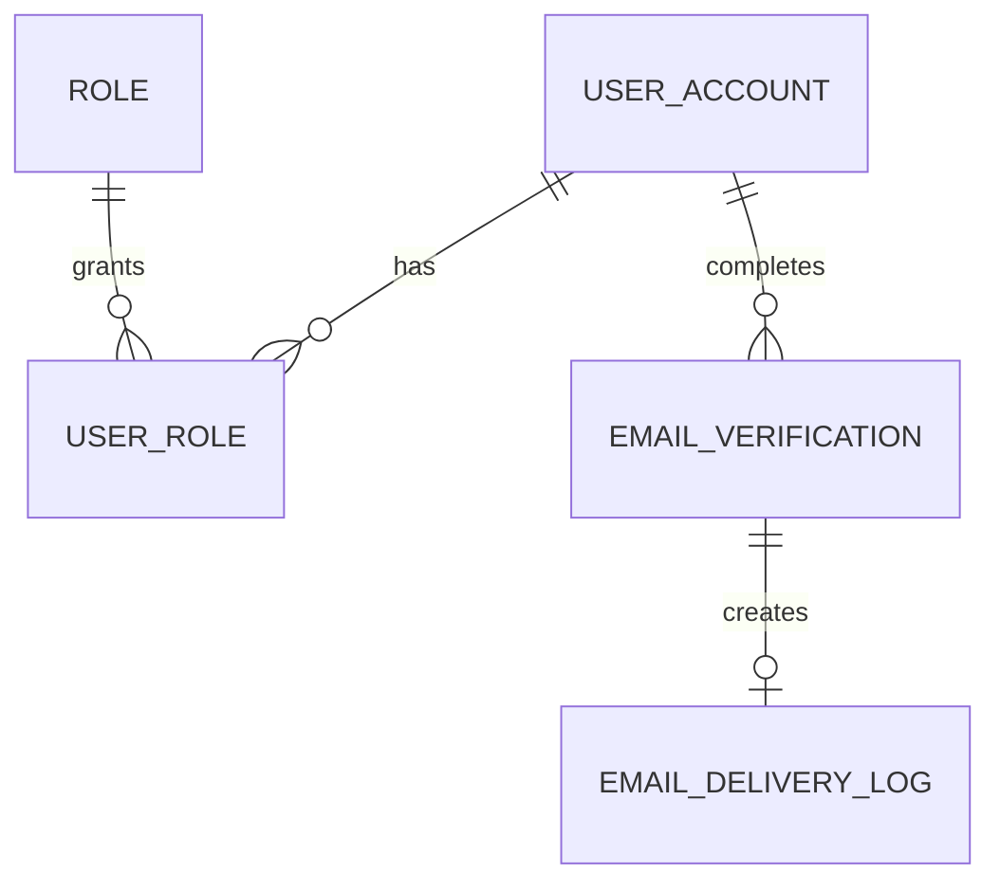
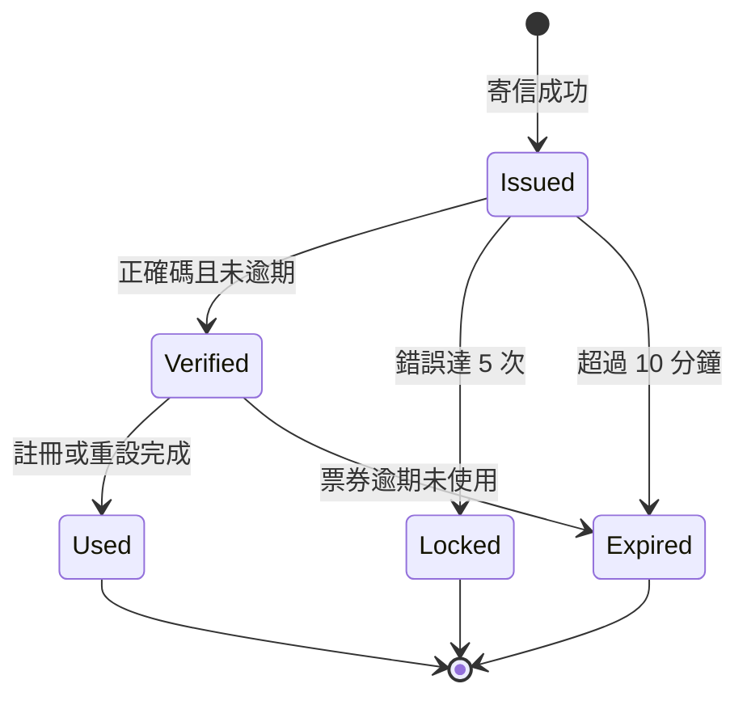

# Data Model：信箱註冊登入

## 目錄

- [關聯總覽](#關聯總覽) — 使用者、角色、驗證與寄送紀錄
- [EmailVerification](#emailverification) — 驗證碼與票券生命週期
- [EmailDeliveryLog](#emaildeliverylog) — 寄信成功與失敗稽核
- [UserAccount 與 UserRole](#useraccount-與-userrole) — 新信箱帳號規則
- [狀態轉移](#狀態轉移) — 產生、驗證、使用與失效
- [安全與索引](#安全與索引) — 唯一性、查詢與敏感資料

## 關聯總覽

`EmailVerification` 在建帳前可尚未關聯使用者，以正規化 email 作為流程識別；完成註冊或重設後才標記使用。

## EmailVerification

資料表：`email_verification`

| 欄位 | 型別 | 規則 |
|---|---|---|
| id | UUID | 主鍵，同時作一次性票券識別 |
| email | varchar(160) | 正規化小寫，必填 |
| purpose | varchar(32) | `REGISTRATION` 或 `PASSWORD_RESET` |
| code_hash | varchar(100) | BCrypt 雜湊，禁止明碼 |
| expires_at | datetime | 建立後 10 分鐘 |
| sent_at | datetime | 寄送完成時間；保留既有資料表相容欄位 |
| status | varchar(20) | `PENDING`、`VERIFIED`、`COMPLETED`、`INVALIDATED`；保留既有狀態相容 |
| failed_attempts | integer | 預設 0，最多 5 |
| verified_at | datetime nullable | 驗證成功時間 |
| used_at | datetime nullable | 建帳或重設完成時間 |
| created_at / updated_at | datetime | JPA auditing |

DAO 需支援查詢同 email、purpose 最新一筆，以及以 id、email、purpose 驗證票券歸屬。

## EmailDeliveryLog

資料表：`email_delivery_log`

| 欄位 | 型別 | 規則 |
|---|---|---|
| id | UUID | 主鍵 |
| email | varchar(160) | 正規化收件信箱，僅後端與 DB 使用 |
| masked_recipient | varchar(180) | 提供 API 顯示 |
| purpose | varchar(32) | `ADMIN_TEST`、`REGISTRATION`、`PASSWORD_RESET` |
| status | varchar(16) | `SUCCESS` 或 `FAILED` |
| error_summary | varchar(240) nullable | 安全摘要，不含秘密或驗證碼 |
| completed_at | datetime | 寄送完成時間 |
| created_at / updated_at | datetime | JPA auditing |

DAO 需支援依 `created_at` 由新到舊取最近 20 筆。

## UserAccount 與 UserRole

- 信箱註冊時 `username=email=normalize(input)`，沿用 `app_user` 的唯一約束。
- `full_name` 預設使用信箱 `@` 前的本地部分，使用者後續可再由既有管理功能更新。
- `password_hash` 使用既有 `PasswordEncoder`（BCrypt）。
- `registration_method` 為 `信箱註冊`。
- 建帳交易同時新增一筆 `user_role`，角色固定為 `EMPLOYEE`。

## 狀態轉移

## 安全與索引

- `app_user.email` 與 `app_user.username` 唯一約束處理併發重複註冊。
- `email_verification(email, purpose, created_at)` 為主要查詢路徑。
- 驗證碼只以 BCrypt 雜湊保存；API、寄送紀錄及日誌不得出現明碼。
- 寄送失敗不建立可用 `EmailVerification`，但建立 `FAILED` 寄送紀錄。
