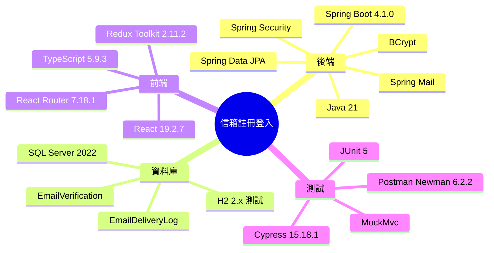

# Implementation Plan：信箱註冊登入

**Branch**：`信箱註冊-帳密登入` | **Date**：2026-07-29 | **Spec**：[spec.md](spec.md)

## 目錄

- [技術樹（心智圖）](#技術樹心智圖) — 前後端、資料庫、郵件與驗收工具
- [Summary](#summary) — 分層實作方向
- [Technical Decision Log](#technical-decision-log) — 安全與相容性取捨
- [Technical Context](#technical-context) — 版本、儲存與限制
- [Constitution Check](#constitution-check) — 六項專案原則
- [Project Structure](#project-structure) — 文件、程式碼與報告位置
  - [Documentation](#documentation) — feature 文件
  - [Source Code](#source-code) — DB 至 React 與測試
- [Implementation Phases](#implementation-phases) — TDD 與依賴順序
- [Complexity Tracking](#complexity-tracking) — mock SMTP 的隔離說明

## 技術樹（心智圖）



條列式 fallback（與上方 Mermaid 內容同步）：

- 根：信箱註冊登入
  - 後端：Java 21、Spring Boot 4.1.0、Spring Data JPA、Spring Security、BCrypt、Spring Mail
  - 資料庫：SQL Server 2022、H2 2.x 測試、EmailVerification、EmailDeliveryLog
  - 前端：React 19.2.7、TypeScript 5.9.3、React Router 7.18.1、Redux Toolkit 2.11.2
  - 測試：JUnit 5、MockMvc、Postman Newman 6.2.2、Cypress 15.18.1

## Summary

沿用管理員 `/api/admin/email-verification/send`，新增寄送紀錄查詢；公開驗證流程使用 `/api/auth/email/**`。`EmailVerification` 保存 BCrypt 驗證碼雜湊與一次性票券狀態，`EmailDeliveryLog` 保存寄送稽核。`EmailVerificationService` 處理寄碼／核銷，`EmailRegistrationService` 處理建帳／重設，Controller 僅驗證輸入與包裝 `ApiResponse`。React 新增註冊與忘記密碼分步頁面，登入頁加入入口並維持 LINE OAuth 與原帳號登入。

## Technical Decision Log

| 決策面向 | 評估方案 | 採用方案 | 理由 |
|---|---|---|---|
| 驗證碼儲存 | 明碼、單向雜湊 | BCrypt 單向雜湊 | 避免資料庫外洩直接取得驗證碼 |
| 核銷狀態 | 記憶體、資料庫 | JPA 資料庫 | 支援多執行個體、重啟及交易一致性 |
| 驗證與建帳 | 單一請求、一次性票券 | 分步票券 | 符合頁面流程且避免重複驗證 |
| 登入識別 | 新增 email 分支、username=email | username=email | 最少修改並保持既有登入相容 |
| 新帳號角色 | 無角色、EMPLOYEE | EMPLOYEE | 符合既有授權模型及最小權限 |
| E2E 郵件 | 真 Gmail、明確 mock profile | mock profile | 無秘密、無網路與配額依賴，正式預設關閉 |

## Technical Context

**Language/Version**：Java 21、TypeScript 5.9.3
**Primary Dependencies**：Spring Boot 4.1.0、Spring Data JPA、Spring Security、Spring Mail、React 19.2.7
**Storage**：SQL Server 2022；測試與本機驗收使用 H2 MSSQLServer mode
**Testing**：JUnit 5、MockMvc、Newman 6.2.2、Cypress 15.18.1
**Target Platform**：Spring Boot REST API 與 React SPA
**Constraints**：驗證碼不得回傳；SMTP mock 只可在明確設定後啟用；既有 API 不可破壞
**Performance Goals**：本機 API 核心流程每步 2 秒內完成，真實 SMTP 受 Gmail 網路影響
**Scale/Scope**：MVP 帳號驗證，不包含寄信佇列、行銷郵件或管理員密碼政策

## Constitution Check

- [x] Controller 僅處理 HTTP；Service 負責業務；JPA DAO 只負責持久化。
- [x] 先建立服務與整合測試，再完成實作，涵蓋錯誤與邊界。
- [x] 只處理 Sheet「預計開發」六條 MUST，不擴張到管理員密碼政策或 LINE OAuth。
- [x] 重複信箱、一次性票券及密碼更新以業務正確性為優先。
- [x] 保留既有管理員寄信、帳號登入與 LINE OAuth API。
- [x] 新增方法與主要段落使用繁體中文註解。

## Project Structure

### Documentation

```text
specs/007-gmail-verification-mail/
├── spec.md
├── plan.md
├── research.md
├── data-model.md
├── quickstart.md
├── contracts/openapi.yaml
├── checklists/requirements.md
├── tasks.md
└── analyze.md
```

### Source Code

```text
backend/src/main/java/com/agentflow/base/
├── model/bo/EmailVerification.java
├── model/bo/EmailDeliveryLog.java
├── dao/EmailVerificationDao.java
├── dao/EmailDeliveryLogDao.java
├── service/EmailDeliveryLogService.java
├── service/EmailVerificationService.java
├── service/EmailRegistrationService.java
├── controller/EmailVerificationController.java
├── controller/EmailAuthController.java
└── model/dto/EmailVerificationDtos.java
frontend/src/
├── pages/EmailRegistrationPage.tsx
├── pages/ForgotPasswordPage.tsx
├── pages/LoginPage.tsx
├── pages/EmailVerificationPage.tsx
├── App.tsx
└── styles.css
frontend/cypress/e2e/email-registration-login.cy.ts
postman/email-registration-login.postman_collection.json
report/test/result-20260729-email-registration-login-postman.md
report/test/result-20260729-email-registration-login-cypress.md
```

## Implementation Phases

1. 先寫 JUnit/MockMvc 合約測試，使完整流程呈紅燈。
2. 建立 `EmailVerification`、`EmailDeliveryLog` BO 與 JPA DAO。
3. 完成寄送紀錄、驗證碼、註冊／重設 Service，再接 Controller。
4. 更新 React 路由、分步頁面、登入入口與管理員紀錄清單。
5. 建立 Postman collection 與 Cypress 規格，啟動 H2 mock SMTP 環境跑到綠燈。
6. 產出測試報告，逐條勾選 tasks/checklist 並核對 FR。

## Complexity Tracking

| 例外 | 為何需要 | 簡化方案不足原因 |
|---|---|---|
| H2 profile 可啟用 mock SMTP 與固定測試碼 | Cypress 需可重現地完成信箱驗證 | 真實 Gmail 需要秘密、網路與人工取信，不適合自動驗收；正式環境預設關閉 |
