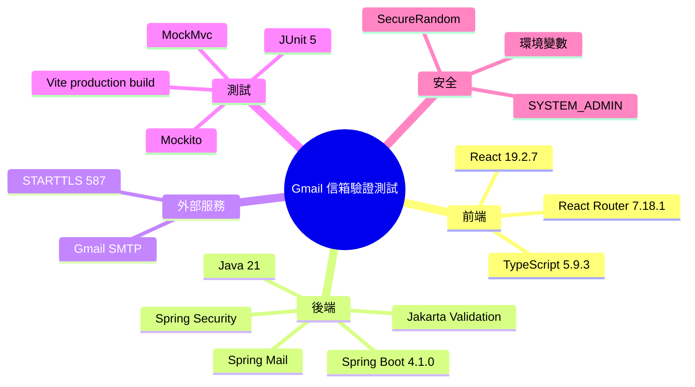

# Implementation Plan：Gmail 信箱驗證測試

**Branch**：`信箱註冊-帳密登入` | **Date**：2026-07-29 | **Spec**：[spec.md](spec.md)

## 目錄

- [技術樹（心智圖）](#技術樹心智圖) — 本功能使用的前後端、SMTP 與測試技術
- [Summary](#summary) — 實作方向
- [Technical Decision Log](#technical-decision-log) — 主要取捨
- [Technical Context](#technical-context) — 版本與限制
- [Constitution Check](#constitution-check) — 六項專案原則檢核
- [Project Structure](#project-structure) — 文件與程式碼位置
  - [Documentation](#documentation) — Feature 文件
  - [Source Code](#source-code) — 後端、前端與測試
- [Complexity Tracking](#complexity-tracking) — 無例外

## 技術樹（心智圖）



條列式 fallback（與上方 Mermaid 內容同步）：

- 根：Gmail 信箱驗證測試
  - 前端：React 19.2.7、TypeScript 5.9.3、React Router 7.18.1
  - 後端：Java 21、Spring Boot 4.1.0、Spring Mail、Jakarta Validation、Spring Security
  - 外部服務：Gmail SMTP、STARTTLS 587
  - 測試：JUnit 5、Mockito、MockMvc、Vite production build
  - 安全：SYSTEM_ADMIN、環境變數、SecureRandom

## Summary

新增管理員專用 React 頁面與 `/api/admin/email-verification/send` API。Controller 只處理驗證與回應；Service 產生驗證碼、組合信件與遮罩回應；MailGateway 封裝 Spring Mail 的 Gmail SMTP 寄送。帳密由環境變數注入，測試以 mock gateway 隔離外部 Gmail。

## Technical Decision Log

| 決策面向 | 評估方案 | 採用方案 | 採用理由 |
|----------|----------|----------|----------|
| SMTP 整合 | Jakarta Mail 原生 API、Spring Mail | Spring Mail | 符合現有 Spring Boot 框架，設定與測試替換成本最低 |
| 寄信抽象 | Service 直接呼叫 JavaMailSender、MailGateway 介面 | MailGateway 介面 | 外部 I/O 可在單元與整合測試中可靠替換 |
| 驗證碼狀態 | 記憶體、資料庫、不保存 | 不保存 | 目前只驗證寄送能力，避免超出需求 |
| 前端狀態 | Redux slice、頁面本地狀態 | 頁面本地狀態 | 只有單頁單次操作，不需要全域狀態 |
| 測試策略 | 真實 Gmail、mock SMTP gateway | mock SMTP gateway | 自動測試不依賴網路、配額與真實秘密 |
| 部署設定 | 明碼設定、環境變數 | 環境變數 | 避免敏感值進入版本庫 |

## Technical Context

**Language/Version**：Java 21、TypeScript 5.9.3  
**Primary Dependencies**：Spring Boot 4.1.0、Spring Mail、React 19.2.7  
**Storage**：不新增資料表  
**Testing**：JUnit 5、Mockito、MockMvc、TypeScript/Vite build  
**Target Platform**：Spring Boot Web API 與 React SPA  
**Project Type**：前後端分離 Web Application  
**Performance Goals**：管理員送出後 30 秒內取得成功或失敗結果  
**Constraints**：Gmail SMTP 配額與網路可用性；API 不回傳驗證碼  
**Scale/Scope**：管理員低頻人工測試，不建立大量寄送系統

## Constitution Check

- [x] Controller、Service、外部寄信 gateway 職責分離。
- [x] 新增服務單元測試及 API 整合測試。
- [x] 僅實作寄信測試 MVP，不建立未要求的驗證碼持久化。
- [x] 優先確保 Gmail 寄信、權限與錯誤回饋正確。
- [x] 只新增 API 與頁面，不變更既有 API 行為。
- [x] 新增方法與主要處理段落使用繁體中文註解。

## Project Structure

### Documentation

```text
specs/007-gmail-verification-mail/
├── spec.md
├── plan.md
├── research.md
├── data-model.md
├── quickstart.md
├── contracts/openapi.yaml
├── checklists/requirements.md
├── tasks.md
└── analyze.md
```

### Source Code

```text
backend/
├── build.gradle
└── src/
    ├── main/java/com/agentflow/base/
    │   ├── config/MailProperties.java
    │   ├── controller/EmailVerificationController.java
    │   ├── model/dto/EmailVerificationDtos.java
    │   └── service/
    │       ├── EmailVerificationService.java
    │       ├── MailGateway.java
    │       └── SmtpMailGateway.java
    └── test/java/com/agentflow/base/
        ├── EmailVerificationIntegrationTest.java
        └── service/EmailVerificationServiceTest.java
frontend/src/
├── App.tsx
├── components/AppShell.tsx
├── pages/EmailVerificationPage.tsx
└── styles.css
```

## Complexity Tracking

無憲法例外或額外複雜度。
