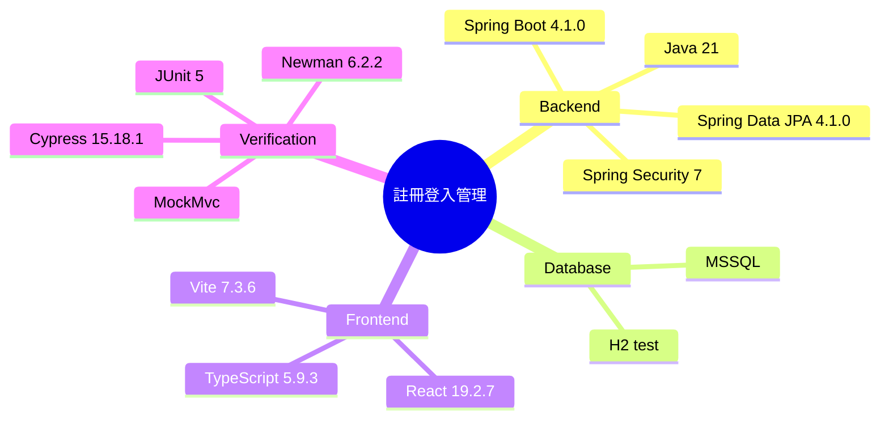

# Implementation Plan：註冊登入管理

## 目錄

- [技術樹（心智圖）](#技術樹心智圖) — 本功能使用的完整技術鏈
- [Technical Context](#technical-context) — 既有技術棧與限制
- [Constitution Check](#constitution-check) — 分層、測試、相容性
- [Architecture](#architecture) — DB 至 React 的資料流
- [Project Structure](#project-structure) — 新增與修改檔案
- [Test Strategy](#test-strategy) — JUnit、Postman、Cypress

## 技術樹（心智圖）

- Backend
  - Java 21
  - Spring Boot 4.1.0
  - Spring Data JPA 4.1.0
  - Spring Security 7
- Database
  - MSSQL
  - H2 test
- Frontend
  - React 19.2.7
  - TypeScript 5.9.3
  - Vite 7.3.6
- Verification
  - JUnit 5、MockMvc、Newman 6.2.2、Cypress 15.18.1

## Technical Context

- 在既有單體專案內增量開發，不新增服務或外部依賴。
- 後端依序維持 BO → DAO(JPA) → Service → Controller。
- API 沿用 `ApiResponse<T>` 與 JWT RBAC。
- 前端沿用既有 `api()`、Redux session、`AppShell` 與共用 CSS。
- UI 以 `uiux/0.共用樣式`、`uiux/1.1.使用者分權` 為視覺與操作依據。

## Constitution Check

- **分層架構**：Controller 只轉換 HTTP；規則在 Service；DAO 僅存取。
- **測試必要性**：先新增 MockMvc 整合測試，再完成實作；補 Postman 與 Cypress。
- **MVP**：只支援 Sheet 指定的三個政策欄位與兩種註冊來源。
- **向後相容**：既有 API 路徑與預設最小長度 8 不變。
- **繁中註解**：所有新增方法具有繁中用途註解。

## Architecture

1. `password_policy` 保存目前政策；`registration_record` 保存首次建帳結果。
2. DAO 提供單筆政策、最近註冊紀錄查詢。
3. `RegistrationManagementService` 管理政策、驗證密碼、寫入與讀取稽核資料。
4. Email 與 LINE 既有 Service 在成功首次建帳時寫入紀錄。
5. `RegistrationManagementController` 提供管理員 GET/PUT API。
6. React `RegistrationManagementPage` 呈現政策表單與紀錄表格。
7. `/registration-management` 由管理員 Guard 保護。

## Project Structure

- `backend/src/main/java/.../model/bo/{PasswordPolicy,RegistrationRecord}.java`
- `backend/src/main/java/.../dao/{PasswordPolicyDao,RegistrationRecordDao}.java`
- `backend/src/main/java/.../model/dto/RegistrationManagementDtos.java`
- `backend/src/main/java/.../service/RegistrationManagementService.java`
- `backend/src/main/java/.../controller/RegistrationManagementController.java`
- `backend/src/test/java/.../RegistrationManagementIntegrationTest.java`
- `frontend/src/pages/RegistrationManagementPage.tsx`
- `frontend/cypress/e2e/registration-management.cy.ts`
- `postman/registration-management.postman_collection.json`
- `report/test/result-20260729-registration-management-{postman,cypress}.md`

## Test Strategy

- MockMvc：政策 GET/PUT、非法政策、密碼拒絕、註冊紀錄、一般使用者 403。
- Postman/Newman：管理員登入、政策更新/讀取、一般使用者 403、紀錄查詢。
- Cypress：管理員頁面政策儲存、紀錄顯示、一般使用者路由拒絕。
- 建置：`backend/gradlew test build` 與 `frontend npm run build`。
