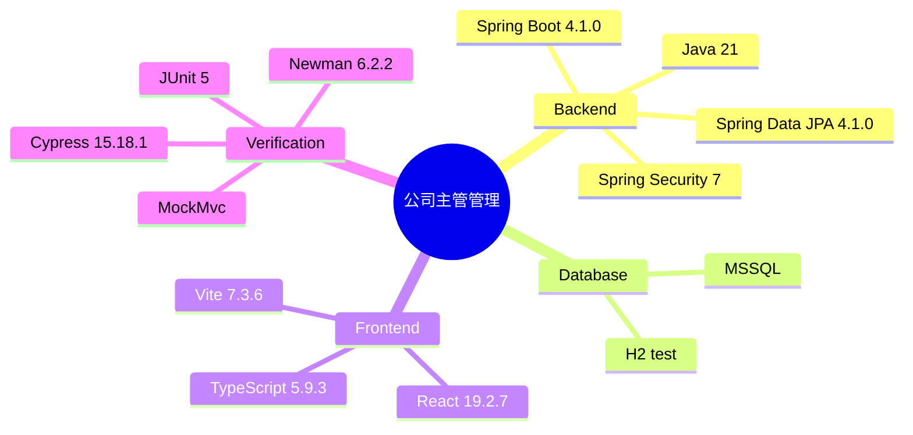

# Implementation Plan：公司主管管理

**Date**：2026-07-29  
**Spec**：[spec.md](spec.md)

## 目錄

- [技術樹（心智圖）](#技術樹心智圖) — 本功能完整技術鏈
- [Summary](#summary) — DB 到 React 的增量實作
- [Technical Decision Log](#technical-decision-log) — 實體、綁定與測試決策
- [Technical Context](#technical-context) — 既有技術棧與限制
- [Constitution Check](#constitution-check) — 分層、測試與相容性
- [Architecture](#architecture) — 資料流與分層
- [Project Structure](#project-structure) — 文件與程式碼路徑
- [Test Strategy](#test-strategy) — JUnit、Postman、Cypress

## 技術樹（心智圖）



- Backend：Java 21、Spring Boot 4.1.0、Spring Data JPA 4.1.0、Spring Security 7
- Database：MSSQL、H2 test
- Frontend：React 19.2.7、TypeScript 5.9.3、Vite 7.3.6
- Verification：JUnit 5、MockMvc、Newman 6.2.2、Cypress 15.18.1

## Summary

在既有單體專案新增 `Company`、`SupervisorProfile`、`CompanyMembership` 三個 BO 與 JPA DAO，由單一 `CompanySupervisorManagementService` 維護公司、主管身分及一人一公司的原子性規則；REST Controller 提供三組管理 API，React 頁面依 `uiux/` 樣式提供公司、主管、綁定三個標籤。

## Technical Decision Log

| 決策面向 | 評估方案 | 採用方案 | 採用理由 |
|---|---|---|---|
| 主管模型 | 獨立主管帳號／既有使用者附加資料 | `SupervisorProfile` 一對一既有使用者 | 完整符合「只能以已註冊使用者綁定」，不複製登入資料 |
| 公司綁定 | 主管專用 join table／通用成員綁定 | `CompanyMembership` 對 `user_id` 唯一 | 同時落實主管與員工一人一公司規則 |
| 刪除策略 | 級聯刪除／有關聯時拒絕 | 回覆 409 並要求先取消綁定 | 避免隱性刪除且符合業務可理解性 |
| UI 資料流 | 新增 Redux slice／頁面局部 state | 頁面局部 state + 既有 `api()` | 單頁管理資料，不增加不必要的全域狀態 |
| 測試策略 | 僅單元／整合加真實 HTTP E2E | MockMvc + Newman + Cypress | 覆蓋分層業務、API response 與真實頁面流程 |

## Technical Context

- **Language/Version**：Java 21、TypeScript 5.9.3。
- **Primary Dependencies**：Spring Boot 4.1.0、JPA、Security、React 19.2.7、Vite 7.3.6。
- **Storage**：MSSQL 正式環境；H2 測試與本機驗收。
- **Testing**：JUnit 5、MockMvc、Newman 6.2.2、Cypress 15.18.1。
- **Target Platform**：Docker/Linux Web 應用。
- **Performance Goals**：一般列表及名稱篩選在測試資料規模下 2 秒內完成。
- **Constraints**：不修改第 16 列後未標示「預計開發」的功能；沿用 JWT 與 `ApiResponse<T>`。
- **Scale/Scope**：單一公司主管管理頁、三組 CRUD/綁定 API、三張新資料表。

## Constitution Check

- **分層架構 PASS**：Controller 僅處理 HTTP；Service 持有規則；DAO 僅存取。
- **測試必要性 PASS**：先建立整合測試，再實作 BO/DAO/Service/Controller/React；追加 Newman 與 Cypress。
- **MVP PASS**：只新增 Sheet 第 12–15 列需要的欄位與操作。
- **業務正確性 PASS**：以資料庫唯一限制及交易 Service 雙重確保一人一公司。
- **向後相容 PASS**：新增路徑，不改既有 API payload。
- **繁中註解 PASS**：所有新增方法與主要段落使用繁中註解。

## Architecture

1. `company` 保存唯一公司名稱與說明。
2. `supervisor_profile` 一對一連到 `app_user`，保存職稱。
3. `company_membership` 以 `user_id` 唯一連接公司，支援一家公司多名成員。
4. JPA DAO 提供忽略大小寫的名稱查詢、關聯存在判斷與綁定搜尋。
5. `CompanySupervisorManagementService` 在交易中執行 CRUD、角色授予/移除、關聯檢查與 DTO 轉換。
6. `CompanySupervisorManagementController` 在 `/api/admin/company-supervisor-management` 暴露 REST API。
7. React `/company-supervisor-management` 以三個標籤呈現管理流程，Route Guard 與側欄僅供系統管理員。

## Project Structure

```text
specs/009-company-supervisor-management/
├── spec.md
├── plan.md
├── research.md
├── data-model.md
├── quickstart.md
├── tasks.md
├── analyze.md
├── checklists/requirements.md
└── contracts/openapi.yaml

backend/src/main/java/com/agentflow/base/
├── model/bo/{Company,SupervisorProfile,CompanyMembership}.java
├── model/dto/CompanySupervisorManagementDtos.java
├── dao/{CompanyDao,SupervisorProfileDao,CompanyMembershipDao}.java
├── service/CompanySupervisorManagementService.java
└── controller/CompanySupervisorManagementController.java

frontend/src/pages/CompanySupervisorManagementPage.tsx
frontend/cypress/e2e/company-supervisor-management.cy.ts
postman/company-supervisor-management.postman_collection.json
report/test/result-20260729-company-supervisor-management-{postman,cypress}.md
```

## Test Strategy

- MockMvc：公司 CRUD、主管必須既有使用者、角色授予、多人同公司、一人第二家公司衝突、名稱查詢、取消後刪除、一般使用者 403。
- Postman/Newman：以啟動中的 H2 API 逐項確認 status、`ApiResponse` 與關鍵 response 值。
- Cypress：管理員使用公司、主管、綁定三標籤完成主流程，另驗證一般使用者無權限頁。
- 建置：`backend/gradlew test build` 與 `frontend npm run build`。
