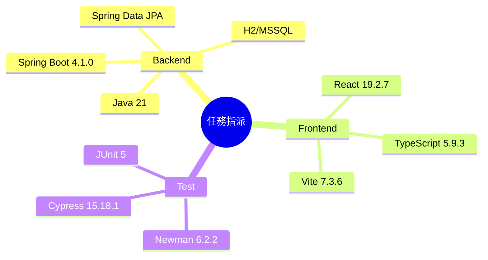

# Implementation Plan：任務指派

## 目錄

- [技術樹（心智圖）](#技術樹心智圖) — 本功能技術
- [Technical Context](#technical-context) — 既有技術棧
- [Constitution Check](#constitution-check) — 六項合規門檻
- [Architecture](#architecture) — 分層與檔案
- [Test Strategy](#test-strategy) — 整合、Postman、Cypress

## 技術樹（心智圖）

- Backend：Java 21、Spring Boot 4.1.0、Spring Data JPA、H2/MSSQL
- Frontend：React 19.2.7、TypeScript 5.9.3、Vite 7.3.6
- Test：JUnit 5、Newman 6.2.2、Cypress 15.18.1

## Technical Context

- 延伸現有單體專案與 `CompanyMembership`，不新增框架。
- REST 基底為 `/api/task-assignment`；主管管理操作以 `MANAGER` 授權，收件匣與公司綁定要求登入。
- JPA `ddl-auto=update` 建立兩張新增表，測試以 H2，正式相容 MSSQL。
- 前端新增 `TaskAssignmentPage`，沿用 `AppShell`、現有 tokens 與表格/卡片樣式。

## Constitution Check

- [x] Controller 僅解析請求，業務規則集中 Service。
- [x] DAO 僅負責資料存取。
- [x] 先建立整合測試再完成實作。
- [x] 僅實作 Sheet 明列 MVP。
- [x] 不破壞既有 API。
- [x] 新增方法採繁體中文註解。

## Architecture

- DB/BO：`SupervisorEmployeeBinding`、`AssignedTask`
- DAO：`SupervisorEmployeeBindingDao`、`AssignedTaskDao`
- Service：`TaskAssignmentService`
- REST：`TaskAssignmentController`、`TaskAssignmentDtos`
- React：`TaskAssignmentPage`、App 路由與側欄
- Contract：見 `contracts/openapi.yaml`

## Test Strategy

- JUnit/MockMvc：資格、跨公司、CRUD、查詢排序、撤回、退回與權限。
- Newman：啟動 H2 後以真實 HTTP 串接管理員建檔、主管登入與任務 API。
- Cypress：真實 UI 建立任務、查詢、收件匣與狀態操作。
- 報告輸出 `report/test/result-20260730-task-assignment-{postman,cypress}.md`。
