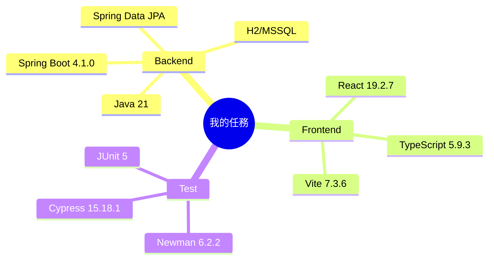

# Implementation Plan：我的任務

## 目錄

- [技術樹（心智圖）](#技術樹心智圖) — 本功能技術
- [Technical Context](#technical-context) — 技術棧與相容策略
- [Constitution Check](#constitution-check) — 合規門檻
- [Architecture](#architecture) — 全端分層
- [Test Strategy](#test-strategy) — 三層驗收

## 技術樹（心智圖）

- Backend：Java 21、Spring Boot 4.1.0、Spring Data JPA、H2/MSSQL
- Frontend：React 19.2.7、TypeScript 5.9.3、Vite 7.3.6
- Test：JUnit 5、Newman 6.2.2、Cypress 15.18.1

## Technical Context

- 延伸現有 `AssignedTask` 與 `/api/task-assignment`，新增欄位皆有預設值以維持相容。
- 新增 `TaskAttachment` 資料表與 DAO；附件以 Base64 JSON 傳輸，Service 解碼並限制 10 MB。
- 新增 `/my-tasks` React 列表頁與 `/my-tasks/:id` 編輯頁，沿用 `uiux/0.共用樣式` 卡片、篩選列、表格與表單流程。

## Constitution Check

- [x] Controller 僅解析與回應，規則集中 Service。
- [x] DAO 僅處理資料存取。
- [x] 先補整合測試，再完成實作。
- [x] 僅處理 Sheet 第 29–39 列。
- [x] 保留既有任務指派行為與回應欄位。
- [x] 新增方法與文件採繁體中文。

## Architecture

- DB/BO：延伸 `assigned_task`；新增 `task_attachment`。
- DAO：擴充 `AssignedTaskDao`；新增 `TaskAttachmentDao`。
- Service：擴充 `TaskAssignmentService` 的本人查詢、進度、附件與流程規則。
- REST：擴充 `TaskAssignmentController` 與 `TaskAssignmentDtos`。
- React：新增 `MyTasksPage` 與 `MyTaskEditPage`，更新路由、側欄及樣式。

## Test Strategy

- JUnit/MockMvc：本人查詢、進度、附件、提交、退回、延期及越權。
- Newman：啟動 H2 後跑真實 HTTP collection，驗證 response 欄位。
- Cypress：真實 UI 查詢、編輯、附件、狀態及三種流程操作。
