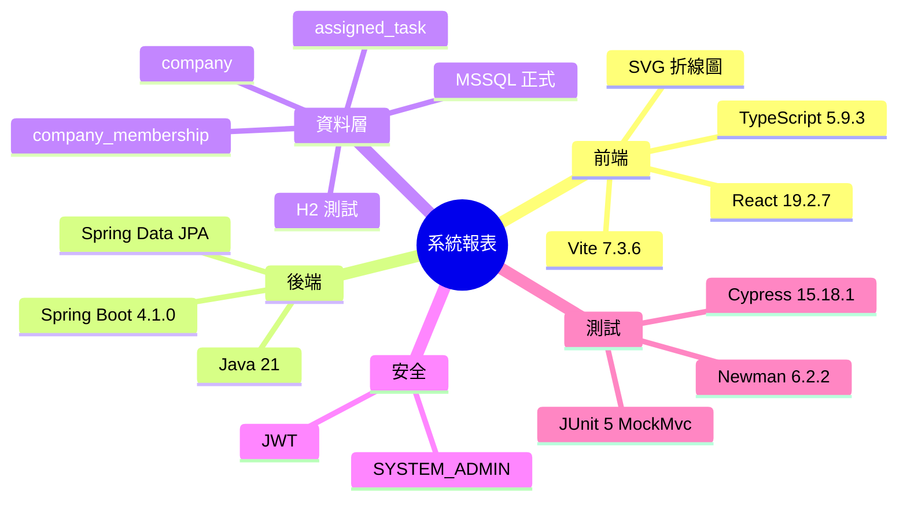

# Implementation Plan：系統報表

**Branch**：`主管員工公司綁定` | **Date**：2026-08-02 | **Spec**：[spec.md](./spec.md)

## 目錄

- [技術樹（心智圖）](#技術樹心智圖) — 系統報表採用技術與版本
- [Summary](#summary) — 全端唯讀報表方案
- [Technical Decision Log](#technical-decision-log) — 彙總、圖表與測試決策
- [Technical Context](#technical-context) — 現有技術棧與限制
- [Constitution Check](#constitution-check) — 開發前後合規門檻
- [Project Structure](#project-structure) — 文件與程式碼落點
  - [Documentation](#documentation) — 本子模組 Speckit 產物
  - [Source Code](#source-code) — DB/DAO 至 React Page
- [Architecture](#architecture) — 分層資料流
- [Test Strategy](#test-strategy) — JUnit、Postman/Newman、Cypress
- [Complexity Tracking](#complexity-tracking) — 無憲法豁免

## 技術樹（心智圖）



- 根：系統報表
  - 前端：React 19.2.7、TypeScript 5.9.3、Vite 7.3.6、原生 SVG 折線圖
  - 後端：Java 21、Spring Boot 4.1.0、Spring Data JPA
  - 資料層：H2 測試、MSSQL 正式、`company`、`company_membership`、`assigned_task`
  - 安全：JWT、`SYSTEM_ADMIN`
  - 測試：JUnit 5 MockMvc、Newman 6.2.2、Cypress 15.18.1

## Summary

新增系統管理員專用的「系統報表」頁面與 `/api/admin/system-reports` 唯讀 API。後端透過 JPA 從既有公司、公司成員與任務表彙總受派任務的每日數量，Service 驗證最多 366 天並補齊零值日期；前端沿用 UIUX 卡片與篩選流程，以無第三方依賴的 SVG 呈現可存取折線圖。

## Technical Decision Log

| 決策面向 | 評估方案 | 採用方案 | 採用理由 |
|---|---|---|---|
| 報表資料 | 新增快照表、SQL view、即時 JPA 查詢 | 即時 JPA 查詢既有三表 | MVP 無同步排程與快照一致性成本，資料量可由 366 天上限控制 |
| 日期彙總 | DB-specific date function、讀取 Instant 後 Service 彙總 | DAO 查出期間內任務，Service 依台北日期彙總補零 | H2/MSSQL 可攜，測試可確定性驗證時區與邊界 |
| 折線圖 | 第三方圖表套件、Canvas、SVG | React 原生 SVG | 不增加依賴，具 DOM 可測性與 aria/文字摘要 |
| API 契約 | 單一綜合端點、公司與趨勢分離 | 公司選項與趨勢分離 | 公司清單可獨立載入，篩選趨勢時避免重傳主檔 |
| 測試策略 | MockMvc only、curl、完整三層 | JUnit + Newman + Cypress | 同時覆蓋規則、真實 HTTP response 與瀏覽器互動 |

## Technical Context

- **Language/Version**：Java 21、TypeScript 5.9.3。
- **Primary Dependencies**：Spring Boot 4.1.0、Spring Data JPA、Spring Security、React 19.2.7、React Router 7.18.1。
- **Storage**：正式 MSSQL，測試/本機 H2；沿用既有三張表，不新增 schema。
- **Testing**：JUnit 5/MockMvc、Newman 6.2.2、Cypress 15.18.1。
- **Target Platform**：Web application，後端 `localhost:8080`、前端 `localhost:5173`。
- **Performance Goals**：366 天與現有 MVP 資料量下，管理員 3 秒內取得可視結果。
- **Constraints**：最多 366 天、Asia/Taipei 日界線、SYSTEM_ADMIN 專用、API envelope 相容。
- **Scale/Scope**：一個「系統報表」子模組、兩個 GET API、一個 React page、一支 Cypress spec。

## Constitution Check

- [x] Controller 只處理 HTTP 參數、驗證註解與 response；Service 承擔日期及彙總規則。
- [x] DAO 只負責 JPA 資料存取，Controller 不直接呼叫 DAO。
- [x] 先建立整合與 E2E 測試，再實作至綠燈。
- [x] 不新增報表快照層，遵循 MVP/YAGNI。
- [x] 新 API 不修改既有契約，維持向後相容。
- [x] 新增方法與文件使用繁體中文註解及說明。

## Project Structure

### Documentation

```text
specs/012-system-report/
├── spec.md
├── plan.md
├── research.md
├── data-model.md
├── quickstart.md
├── tasks.md
├── analyze.md
├── checklists/requirements.md
└── contracts/openapi.yaml
```

### Source Code

```text
Backend/src/main/java/com/agentflow/base/
├── dao/AssignedTaskDao.java
├── model/dto/SystemReportDtos.java
├── service/SystemReportService.java
└── controller/SystemReportController.java

Backend/src/test/java/com/agentflow/base/
└── SystemReportIntegrationTest.java

Frontend/src/
├── pages/SystemReportPage.tsx
├── components/TaskTrendChart.tsx
├── App.tsx
├── components/AppShell.tsx
└── styles.css

Frontend/cypress/e2e/system-report.cy.ts
postman/system-report.postman_collection.json
report/test/result-20260802-system-report-postman.md
report/test/result-20260802-system-report-cypress.md0
```

## Architecture

1. `company`、`company_membership`、`assigned_task` 提供現有持久資料。
2. `AssignedTaskDao` 依受派人公司與 `assignedAt` 查詢區間任務。
3. `SystemReportService` 驗證範圍、套用公司選項、轉為台北日期並補零。
4. `SystemReportDtos` 提供公司選項、趨勢點與摘要 model。
5. `SystemReportController` 以 `@PreAuthorize` 暴露管理員 REST API。
6. `SystemReportPage` 載入篩選與結果，`TaskTrendChart` 以 SVG 呈現折線圖。

## Test Strategy

- JUnit/MockMvc：全部公司、單一公司、含首尾期間、零值補點、錯誤日期、不存在公司與非管理員 403。
- Newman/Postman：啟動 H2 真實後端，以 admin 登入後驗證公司選項、預設/指定趨勢 response 欄位與權限拒絕。
- Cypress：建立兩家公司與任務，從系統報表 UI 驗證預設一年、公司/日期篩選、折線圖、摘要與空資料。
- Build：`./Backend/gradlew -p Backend clean test` 與 `npm --prefix Frontend run build`。

## Complexity Tracking

無憲法違規或需豁免項目。
