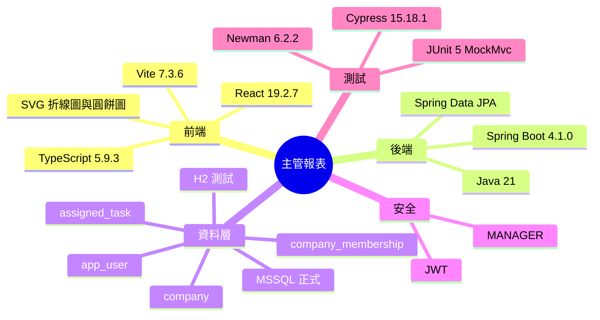

# Implementation Plan：主管報表

**Branch**：`主管員工公司綁定` | **Date**：2026-08-02 | **Spec**：[spec.md](./spec.md)

## 目錄

- [技術樹（心智圖）](#技術樹心智圖) — 主管報表採用技術與版本
- [Summary](#summary) — 公司摘要與主管個人指派圖表方案
- [Technical Decision Log](#technical-decision-log) — 查詢、狀態、圖表與測試決策
- [Technical Context](#technical-context) — 現有技術棧與限制
- [Constitution Check](#constitution-check) — 開發前後合規門檻
- [Project Structure](#project-structure) — 文件與程式碼落點
  - [Documentation](#documentation) — 本子模組 Speckit 產物
  - [Source Code](#source-code) — DB/DAO 至 React Page
- [Architecture](#architecture) — 分層資料流
- [Test Strategy](#test-strategy) — JUnit、Postman/Newman、Cypress
- [Complexity Tracking](#complexity-tracking) — 無憲法豁免

## 技術樹（心智圖）



- 根：主管報表
  - 前端：React 19.2.7、TypeScript 5.9.3、Vite 7.3.6、原生 SVG 折線圖與圓餅圖
  - 後端：Java 21、Spring Boot 4.1.0、Spring Data JPA
  - 資料層：H2 測試、MSSQL 正式、`company`、`company_membership`、`app_user`、`assigned_task`
  - 安全：JWT、`MANAGER`
  - 測試：JUnit 5 MockMvc、Newman 6.2.2、Cypress 15.18.1

## Summary

新增主管專用 `/api/manager/reports` 唯讀 API 與「主管報表」React page。後端透過 JPA 取得公司範圍任務與目前主管建立任務，Service 驗證台北日期、執行者及執行狀態後彙總；前端共用一組篩選，在兩個標籤以可存取 SVG 折線圖及圓餅圖呈現。

## Technical Decision Log

| 決策面向 | 評估方案 | 採用方案 | 採用理由 |
|---|---|---|---|
| DB 資料 | 新增報表表、建立 SQL view、即時查詢既有表 | 即時 JPA 查詢既有四表 | MVP 不需同步排程，366 天上限可控制資料量且保持最新結果 |
| 查詢投影 | 載入完整 Entity graph、DB-specific group by、最小 DTO projection | 最小 DTO projection 後由 Service 彙總 | 保留 H2/MSSQL 可攜性並避免不必要欄位與 lazy loading |
| 執行狀態 | 指派狀態、工作狀態、雙狀態 | `WorkStatus` 工作狀態 | 與「執行狀態」語意及既有進度功能一致 |
| 圖表 | 第三方套件、Canvas、原生 SVG | React 原生 SVG | 無新增依賴、DOM 可測且能提供文字替代 |
| API 契約 | 趨勢／比例分離、一次回傳綜合報表 | 一個 filters 端點與一個綜合 report 端點 | 共用篩選只需一次查詢，避免兩標籤資料時間點不一致 |
| 測試 | MockMvc only、curl、JUnit + Newman + Cypress | 三層完整驗收 | 同時驗證業務規則、真實 HTTP response 與使用者操作流程 |

## Technical Context

- **Language/Version**：Java 21、TypeScript 5.9.3。
- **Primary Dependencies**：Spring Boot 4.1.0、Spring Data JPA、Spring Security、React 19.2.7、React Router 7.18.1。
- **Storage**：正式 MSSQL，測試／本機 H2；沿用既有四張表，不新增 schema。
- **Testing**：JUnit 5／MockMvc、Newman 6.2.2、Cypress 15.18.1。
- **Target Platform**：Web application，後端 `localhost:8080`、前端 `localhost:5173`。
- **Performance Goals**：366 天與既有 MVP 資料量下，主管 3 秒內取得兩張圖表結果。
- **Constraints**：最多 366 天、Asia/Taipei 日界線、MANAGER 專用、API envelope 相容。
- **Scale/Scope**：一個「主管報表」子模組、兩個 GET API、一個 React page、一支 Cypress spec。

## Constitution Check

- [x] Controller 僅處理 HTTP 參數、Principal、驗證註解與 response；Service 承擔所有報表規則。
- [x] DAO 僅負責 JPA 唯讀查詢，Controller 不直接呼叫 DAO。
- [x] 先建立整合與 E2E 測試，再實作至綠燈。
- [x] 不新增快照表或圖表依賴，遵循 MVP／YAGNI。
- [x] 只新增 API、page、DTO 與 DAO query，不破壞既有契約。
- [x] 新增方法、函式、規格與測試報告均使用繁體中文說明。

## Project Structure

### Documentation

```text
specs/013-manager-report/
├── spec.md
├── plan.md
├── research.md
├── data-model.md
├── quickstart.md
├── tasks.md
├── analyze.md
├── checklists/requirements.md
└── contracts/openapi.yaml
```

### Source Code

```text
backend/src/main/java/com/agentflow/base/
├── dao/AssignedTaskDao.java
├── model/dto/ManagerReportDtos.java
├── service/ManagerReportService.java
├── controller/ManagerReportController.java
└── config/SecurityConfig.java

backend/src/test/java/com/agentflow/base/
└── ManagerReportIntegrationTest.java

frontend/src/
├── pages/ManagerReportPage.tsx
├── components/TaskTrendChart.tsx
├── components/TaskStatusPieChart.tsx
├── App.tsx
├── components/AppShell.tsx
└── styles.css

frontend/cypress/e2e/manager-report.cy.ts
postman/manager-report.postman_collection.json
report/test/result-20260802-manager-report-postman.md
report/test/result-20260802-manager-report-cypress.md0
```

## Architecture

1. `company`、`company_membership`、`app_user`、`assigned_task` 提供既有持久資料，不建立報表快照表。
2. `AssignedTaskDao` 以最小 projection 分別查詢公司任務與目前主管建立任務。
3. `ManagerReportService` 驗證主管公司、日期、執行者、工作狀態，並彙總公司摘要、補零趨勢與狀態比例。
4. `ManagerReportDtos` 提供 filters、來源資料、趨勢點、狀態桶與綜合 report model。
5. `ManagerReportController` 以 `@PreAuthorize` 與 Principal 暴露主管 REST API。
6. `ManagerReportPage` 共用篩選與標籤狀態，`TaskTrendChart`、`TaskStatusPieChart` 分別呈現兩張圖。

## Test Strategy

- JUnit／MockMvc：公司與主管隔離、執行者／工作狀態／日期篩選、補零、比例、無公司、非法條件與非主管 403。
- Newman／Postman：啟動 H2 真實後端，以 manager 登入後驗證 filters、report response 及 employee 權限拒絕。
- Cypress：以攔截的確定性 API fixture 驗證預設一年、共用篩選、標籤切換、折線圖、圓餅圖、摘要與空資料。
- Build：`./backend/gradlew -p backend clean test` 與 `npm --prefix frontend run build`。

## Complexity Tracking

無憲法違規或需豁免項目。
