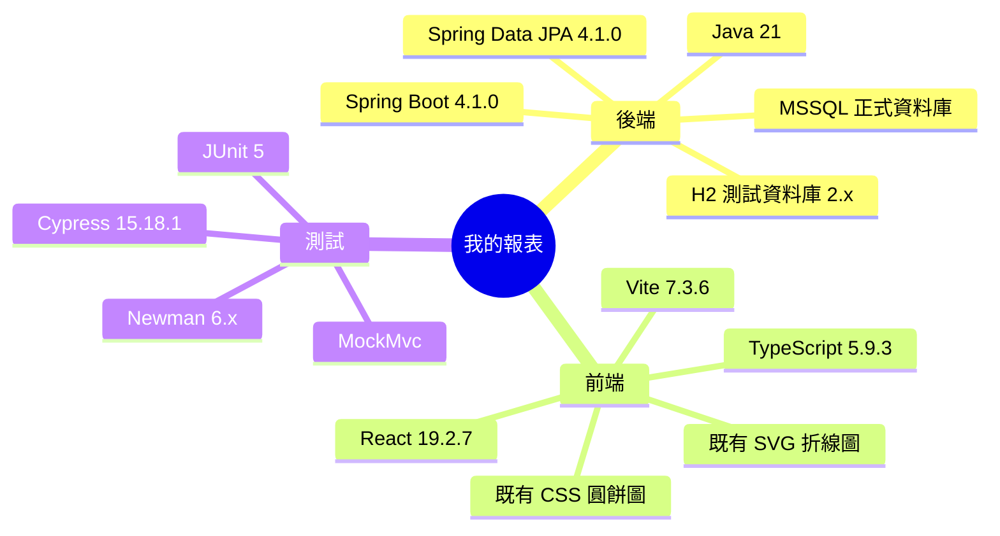

# Implementation Plan: 我的報表

**Branch**: `主管員工公司綁定` | **Date**: 2026-08-02 | **Spec**: [spec.md](./spec.md)

## 目錄

- [技術樹（心智圖）](#技術樹心智圖) — 本功能實際使用技術
- [Summary](#summary) — 個人任務報表全端方案
- [Technical Context](#technical-context) — Java、Spring、React 與測試技術
- [Constitution Check](#constitution-check) — 6 項原則符合性
- [Project Structure](#project-structure) — 新增與修改檔案
- [Data Flow](#data-flow) — DB 至頁面資料流程
- [Implementation Phases](#implementation-phases) — TDD 分階段落地
- [Test Strategy](#test-strategy) — 整合、Postman、Cypress 與建置
- [Complexity Tracking](#complexity-tracking) — 無憲法豁免

## 技術樹（心智圖）



- 我的報表
  - 後端：Java 21、Spring Boot 4.1.0、Spring Data JPA 4.1.0、H2 2.x、MSSQL
  - 前端：React 19.2.7、TypeScript 5.9.3、Vite 7.3.6、既有 SVG 折線圖、既有 CSS 圓餅圖
  - 測試：JUnit 5、MockMvc、Newman 6.x、Cypress 15.18.1

## Summary

新增「我的報表」員工頁面與 `/api/my/reports` API。JPA DAO 直接查詢既有 `assigned_task`，Service 強制以 principal 對應的 `UserAccount` 作為受派人邊界，產生總數、連續每日趨勢及三種狀態比例。前端沿用 `uiux/0.共用樣式` 與主管報表布局，提供兩個圖表標籤與共用篩選。

## Technical Context

**Language/Version**: Java 21、TypeScript 5.9.3
**Primary Dependencies**: Spring Boot 4.1.0、Spring Data JPA、Spring Security、React 19.2.7、React Router 7.18.1
**Storage**: 沿用 MSSQL `assigned_task` 與 `app_user`；整合測試使用獨立 H2
**Testing**: JUnit 5 + MockMvc、Newman、Cypress 15.18.1
**Target Platform**: 現有 Spring Boot + Vite Web 應用
**Performance Goals**: 366 天內報表測試環境 2 秒內回應
**Constraints**: 僅登入員工本人、台北時區、日期上限 366 天、統一 ApiResponse
**Scale/Scope**: 單一員工一年內任務；不做跨員工與資料倉儲

## Constitution Check

| 原則 | 設計對應 | 狀態 |
|---|---|---|
| I 分層架構 | Controller → Service → AssignedTaskDao，無跨層存取 | PASS |
| II 測試必要性 | MockMvc 整合、Newman、Cypress 與 build | PASS |
| III MVP | 沿用既有表與圖表元件，不建快照表 | PASS |
| IV 業務正確性 | principal 綁定受派人，跨員工識別拒絕 | PASS |
| V 向後相容 | 僅新增 API/route；既有空狀態視為 PENDING | PASS |
| VI 文件註解 | 新增規格與方法註解均使用繁體中文 | PASS |

## Project Structure

```text
backend/src/main/java/com/agentflow/base/
├── dao/AssignedTaskDao.java                         # 新增本人報表 JPA projection 查詢
├── model/dto/MyReportDtos.java                      # BO/DTO records
├── service/MyReportService.java                     # 日期、授權與聚合業務邏輯
└── controller/MyReportController.java               # REST API
backend/src/test/java/com/agentflow/base/
└── MyReportIntegrationTest.java                     # TDD 整合驗證
frontend/src/
├── pages/MyReportPage.tsx                           # React 頁面
├── components/TaskStatusPieChart.tsx                # 可配置 test id
├── App.tsx                                          # route
└── components/AppShell.tsx                          # navigation
frontend/cypress/e2e/my-report.cy.ts                 # E2E
postman/my-report.postman_collection.json            # 真實 API collection
report/test/result-20260802-my-report-{postman,cypress.md0}
skills/business-logic/my-report/SKILL.md
```

## Data Flow

1. React 以 JWT 呼叫 `/api/my/reports/filters` 取得本人選項、狀態與最近一年日期。
2. Controller 解析 principal 與 query，不含業務邏輯。
3. Service 以 `UserAccountDao` 找到登入員工，拒絕非本人 `assigneeId`，驗證日期及狀態。
4. `AssignedTaskDao` 以 `task.assignee = :assignee` 及期間／狀態條件查詢 projection。
5. Service 依 `Asia/Taipei` 補齊每日趨勢、聚合三個狀態桶及百分比。
6. React 以既有圖表元件呈現摘要、折線圖與圓餅圖。

## Implementation Phases

1. **Setup / 規格**：完成 spec、clarification、requirements checklist、research、data model、contract、quickstart、tasks、analyze。
2. **Tests First**：先新增 `MyReportIntegrationTest`，涵蓋本人隔離、篩選、空資料、錯誤與未登入。
3. **Backend**：新增 DAO projection、DTO、Service、Controller，跑專屬與完整 Gradle tests。
4. **Frontend**：新增 route、navigation、page，沿用共用樣式與可存取圖表元件，跑 production build。
5. **Acceptance**：啟動後端與前端，實際跑 Newman 與專屬 Cypress，產出 100% 報告。
6. **Closeout**：完成 task/checklist、business skill、Google Sheet B23:B25 回寫與 git commit。

## Test Strategy

- **JUnit/MockMvc**：本人任務隔離、三種狀態、日期預設及上限、非法狀態、非本人 assigneeId、401。
- **Postman/Newman**：登入、filters、default report、狀態與日期篩選、非法日期、跨員工識別拒絕；逐項檢查 response 值。
- **Cypress**：登入、導覽我的報表、摘要、兩標籤、篩選 request、圓餅圖、空資料與未登入導頁。
- **Build**：`./gradlew test build`（含前端 production build）與專屬測試命令全部綠燈。

## Complexity Tracking

無憲法違規或豁免。沿用既有資料表、DAO 與通用圖表元件是最低複雜度方案。
