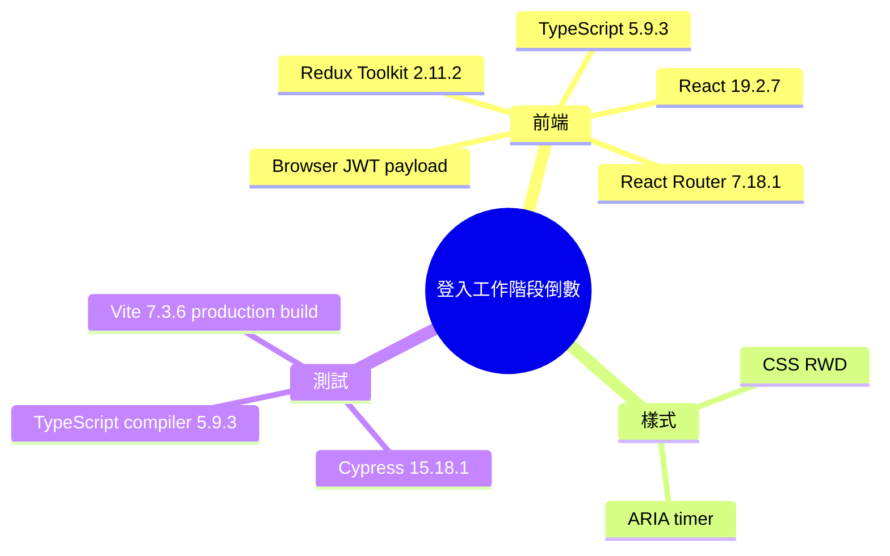

# Implementation Plan：登入工作階段倒數

**Branch**：`主管員工公司綁定` | **Date**：2026-08-02 | **Spec**：[spec.md](./spec.md)

## 目錄

- [技術樹（心智圖）](#技術樹心智圖) — 本功能實際使用技術
- [Summary](#summary) — JWT exp 驅動的前端倒數
- [Technical Decision Log](#technical-decision-log) — 4 項方案取捨
- [Technical Context](#technical-context) — React、TypeScript 與 Cypress
- [Constitution Check](#constitution-check) — 6 項原則符合性
- [Project Structure](#project-structure) — 文件、元件與測試位置
- [Data Flow](#data-flow) — token 至逾時導頁流程
- [Implementation Phases](#implementation-phases) — 文件、TDD、元件與驗收
- [Test Strategy](#test-strategy) — build 與瀏覽器時間控制
- [Complexity Tracking](#complexity-tracking) — 無豁免

## 技術樹（心智圖）



- 登入工作階段倒數
  - 前端：React 19.2.7、TypeScript 5.9.3、React Router 7.18.1、Redux Toolkit 2.11.2、瀏覽器 JWT payload 解析
  - 樣式：CSS RWD、ARIA timer
  - 測試：Cypress 15.18.1、TypeScript compiler 5.9.3、Vite 7.3.6 production build

## Summary

新增獨立 `SessionCountdown` 元件，從 Redux session 的 JWT payload 讀取 `exp`，以絕對時間每秒重算並顯示於 `AppShell` 右上角。歸零後沿用 auth slice 的 logout 清除 session/token 並保存逾時原因，以 React Router replace 導回登入頁；登入頁顯示原因。Cypress 以可控制時鐘的短效 JWT 驗證完整流程。

## Technical Decision Log

| 決策面向 | 評估方案 | 採用方案 | 採用理由 |
|---|---|---|---|
| 到期資料來源 | 前端固定 120 分鐘／LoginResponse 新增 expiresAt／JWT `exp` | JWT `exp` | 單一來源、涵蓋所有登入方式、不變更 API |
| 計時方式 | tick 累減／絕對時間重算 | 絕對時間重算 | 可抵抗背景節流、休眠與延遲 |
| UI 結構 | 直接塞入 AppShell 邏輯／獨立元件 | 獨立元件 | 讓解析、格式與 timer 副作用可集中維護 |
| 測試策略 | 真等候兩分鐘／mock component／Cypress 控制瀏覽器時鐘 | Cypress 控制時鐘 | 快速且能驗證真實 Redux、Router、localStorage 整合 |

## Technical Context

**Language/Version**：TypeScript 5.9.3  
**Primary Dependencies**：React 19.2.7、React Router 7.18.1、Redux Toolkit 2.11.2  
**Storage**：既有 `localStorage.session` 與 `localStorage.token`；無新增持久化資料  
**Testing**：Cypress 15.18.1、`tsc -b`、Vite 7.3.6 build  
**Target Platform**：現有桌面與行動瀏覽器 SPA  
**Project Type**：React 前端功能  
**Performance Goals**：每秒一次輕量重算；到期後 1.5 秒內完成導頁  
**Constraints**：不驗證 JWT 簽章、不新增依賴、不改後端 LoginResponse、不破壞 opaque mock token  
**Scale/Scope**：每個已登入瀏覽器分頁一個 timer

## Constitution Check

| 原則 | 設計對應 | 狀態 |
|---|---|---|
| I 分層架構 | JWT 時間與顯示封裝於元件，登出仍由 auth slice 負責 | PASS |
| II 測試必要性 | 專屬 Cypress 覆蓋倒數與到期；production build 驗證型別 | PASS |
| III MVP | 沿用 JWT exp、Redux 與 Router，不新增後端端點或套件 | PASS |
| IV 業務正確性 | 伺服器 JWT exp 是唯一期限，前端不自行續期 | PASS |
| V 向後相容 | 缺少 exp 的測試替身不被假期限強制登出；正式 API 仍裁決授權 | PASS |
| VI 文件註解 | 規格、測試名稱與可讀文案使用繁體中文 | PASS |

Phase 1 設計後重核：無資料庫、API 或後端安全模型變更，六項仍為 PASS。

## Project Structure

```text
specs/015-login-session-countdown/
├── spec.md
├── plan.md
├── research.md
├── data-model.md
├── quickstart.md
├── analyze.md
├── contracts/session-countdown.md
├── checklists/requirements.md
└── tasks.md
frontend/src/
├── components/AppShell.tsx
├── components/SessionCountdown.tsx
├── features/auth/authSlice.ts
├── pages/LoginPage.tsx
└── styles.css
frontend/cypress/e2e/login-session-countdown.cy.ts
frontend/package.json
skills/business-logic/login-session-countdown/SKILL.md
skills/SKILLS_INDEX.md
```

## Data Flow

1. 登入成功後既有 auth slice 將包含 JWT 的 session 與 token 寫入 Redux/localStorage。
2. `AppShell` 把 `session.token` 傳給 `SessionCountdown`。
3. 元件只讀解析 payload 的數值 `exp`，換算為毫秒到期點。
4. 首次 render、每秒 interval、visibilitychange 與 focus 都執行 `ceil((exp-now)/1000)`。
5. 歸零時只呼叫一次 AppShell 提供的逾時 callback。
6. callback dispatch 帶 `session-expired` 原因的 logout，清除登入資料，並 replace 導向 `/login`。

## Implementation Phases

1. **Specification**：完成 spec、clarification、requirements checklist、plan、research、data model、UI contract、quickstart、tasks 與 analyze。
2. **Tests First**：新增短效 JWT Cypress 情境並確認未有倒數元件時紅燈。
3. **Core**：實作 JWT exp 解析、格式化、絕對時間倒數、背景恢復校時與一次性 expiry callback。
4. **Integration**：接入 AppShell、auth logout、LoginPage 提示與 RWD/警示樣式。
5. **Acceptance**：跑專屬 Cypress 與 production build，完成 tasks/checklist 與 business skill。

## Test Strategy

- **Cypress 顯示**：固定瀏覽器現在時間，注入 120 秒後到期的標準 JWT，驗證 `00:02:00 → 00:01:59`。
- **Cypress 到期**：時鐘跨越到期點，驗證 URL 為 `/login`、session/token 已清除、顯示逾時訊息。
- **Cypress RWD**：以窄螢幕驗證 timer 仍可見且保留 `HH:MM:SS`。
- **Build**：`npm run build` 驗證 TypeScript、React 與 Vite production bundle。

## Complexity Tracking

無憲法違規或豁免；新增一個無第三方依賴的前端元件是最低複雜度方案。
