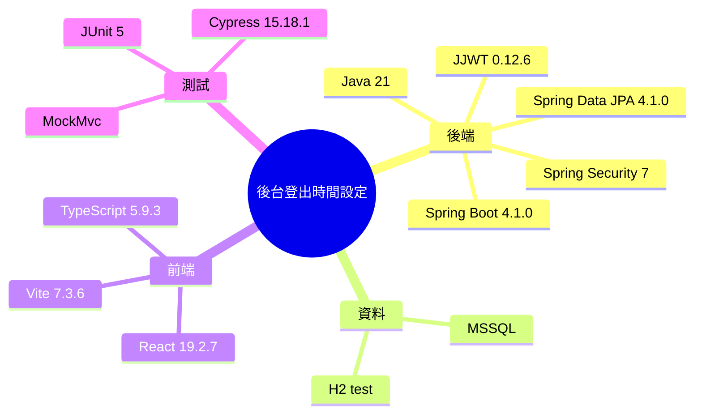

# Implementation Plan：後台登出時間設定

**Branch**：`主管員工公司綁定` | **Date**：2026-08-02 | **Spec**：[spec.md](./spec.md)

## 目錄

- [技術樹（心智圖）](#技術樹心智圖) — Java、JPA、React 與測試
- [Summary](#summary) — DB 政策驅動 JWT exp
- [Technical Decision Log](#technical-decision-log) — 4 項方案取捨
- [Technical Context](#technical-context) — 現有技術與限制
- [Constitution Check](#constitution-check) — 6 項 PASS
- [Project Structure](#project-structure) — 新增與修改檔案
- [Data Flow](#data-flow) — 後台設定至登入倒數
- [Implementation Phases](#implementation-phases) — TDD 分階段落地
- [Test Strategy](#test-strategy) — MockMvc、Cypress 與 build
- [Complexity Tracking](#complexity-tracking) — 無豁免

## 技術樹（心智圖）



- 後台登出時間設定
  - 後端：Java 21、Spring Boot 4.1.0、Spring Security 7、JJWT 0.12.6、Spring Data JPA 4.1.0
  - 資料：MSSQL、H2 test
  - 前端：React 19.2.7、TypeScript 5.9.3、Vite 7.3.6
  - 測試：JUnit 5、MockMvc、Cypress 15.18.1

## Summary

新增 singleton `session_timeout_policy`、DAO 與 Service。管理員透過註冊登入管理 GET/PUT API 與 React 卡片設定 5–1440 分鐘；`JwtService.create()` 每次簽發時讀取目前政策產生 `exp`，因此 feature 015 的前端倒數無需變更即可同步顯示。

## Technical Decision Log

| 決策面向 | 評估方案 | 採用方案 | 採用理由 |
|---|---|---|---|
| 儲存 | 環境變數／一般設定表／專用 singleton 表 | 專用 singleton 表 | 具型別、審計時間且符合既有 PasswordPolicy 模式 |
| 生效 | 撤銷全部 token／前端覆寫／新 JWT 套用 | 新 JWT 套用 | 無狀態 JWT 下維持伺服器與前端一致 |
| 後台位置 | 新 route／使用者頁／註冊登入管理 | 註冊登入管理卡片 | 沿用安全政策 UI、API namespace 與 RBAC |
| 測試 | 只測 UI／只測 Service／MockMvc + JWT claims + Cypress | 三層驗證 | 同時覆蓋資料、簽發與使用者操作 |

## Technical Context

**Language/Version**：Java 21、TypeScript 5.9.3  
**Primary Dependencies**：Spring Boot 4.1.0、Spring Data JPA、Spring Security 7、JJWT 0.12.6、React 19.2.7  
**Storage**：MSSQL `session_timeout_policy`；測試 H2  
**Testing**：JUnit 5、MockMvc、Cypress 15.18.1、Vite build  
**Target Platform**：現有 Spring Boot + React Web 應用  
**Project Type**：全端安全政策功能  
**Performance Goals**：政策讀寫 2 秒內；登入多一次 singleton 查詢 100ms 內  
**Constraints**：5–1440 分鐘、SYSTEM_ADMIN、舊 JWT 不變、不新增 cache  
**Scale/Scope**：全系統單一政策

## Constitution Check

| 原則 | 設計對應 | 狀態 |
|---|---|---|
| I 分層架構 | BO → DAO → SessionTimeoutPolicyService → Controller/JwtService | PASS |
| II 測試必要性 | 先寫 MockMvc/JWT 與 Cypress 紅燈 | PASS |
| III MVP | 單欄位 singleton，不建通用設定框架 | PASS |
| IV 業務正確性 | JWT exp 由伺服器目前政策簽發，前端只讀 exp | PASS |
| V 向後相容 | 初值沿用環境設定；既有 token 與 API 不變 | PASS |
| VI 文件註解 | 新增方法與規格使用繁中 | PASS |

Phase 1 設計後重核：沒有額外服務或憲法豁免，六項仍為 PASS。

## Project Structure

```text
backend/src/main/java/com/agentflow/base/
├── model/bo/SessionTimeoutPolicy.java
├── dao/SessionTimeoutPolicyDao.java
├── model/dto/RegistrationManagementDtos.java
├── service/SessionTimeoutPolicyService.java
├── controller/RegistrationManagementController.java
└── security/JwtService.java
backend/src/test/java/com/agentflow/base/
└── RegistrationManagementIntegrationTest.java
frontend/src/pages/RegistrationManagementPage.tsx
frontend/src/styles.css
frontend/cypress/e2e/session-timeout-settings.cy.ts
frontend/package.json
skills/business-logic/{registration-management,login-session-countdown}/SKILL.md
specs/016-session-timeout-settings/
```

## Data Flow

1. 管理頁並行 GET password policy、session timeout policy 與 registration records。
2. 管理員 PUT `timeoutMinutes`；Controller 只收送 DTO。
3. `SessionTimeoutPolicyService` 驗證 5–1440 並保存 singleton。
4. 任一登入流程呼叫共用 `JwtService.create()`。
5. JwtService 向 policy service 讀取目前分鐘數，設定 `iat` 與 `exp`。
6. 前端既有 SessionCountdown 解析 exp 並顯示相同期限。

## Implementation Phases

1. **Specification**：完成 spec、checklist、plan、research、data model、contract、quickstart、tasks、analyze。
2. **Tests First**：擴充後端整合測試與新增設定頁 Cypress，確認缺少 API/UI 時紅燈。
3. **Backend**：實作 BO、DAO、Service、DTO、Controller 與 JwtService 動態效期。
4. **Frontend**：新增登入工作階段卡片、提示與 RWD，沿用既有倒數。
5. **Acceptance**：跑後端專屬/完整測試、前端 build、專屬 Cypress，更新 business skills。

## Test Strategy

- **MockMvc/JWT**：GET/PUT、4/1441 拒絕、一般使用者 403、更新後新 JWT `exp - iat`。
- **Cypress**：mock 管理 API，驗證目前值、更新 payload、成功訊息、範圍與生效說明。
- **Regression**：feature 015 倒數 Cypress 仍通過，證明新設定仍以 JWT exp 為單一來源。
- **Build**：Gradle tests/build 與前端 production build。

## Complexity Tracking

無憲法違規或豁免；專用 singleton 表比通用設定框架更符合單一需求與 MVP。
